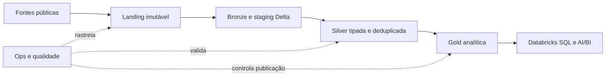

# RastroPúblico

## Apresentação

Plataforma de Engenharia de Dados que transforma compras públicas brasileiras de
tecnologia em conjuntos analíticos rastreáveis para explorar órgãos,
fornecedores, itens, resultados e contratos.

[**Documentação técnica**](docs/00-indice-documentacao.md) · [**Arquitetura**](docs/03-arquitetura-e-operacao.md) · [**Modelo analítico**](docs/04-modelo-e-metricas.md) · [](https://github.com/victorhobdev/RastroPublico/actions/workflows/ci.yml)


O projeto aplica PySpark, Delta Lake e Databricks a um pipeline batch em camadas
Bronze, Silver e Gold. Os indicadores são descritivos e auditáveis: apoiam
investigação, sem classificar fraude, corrupção ou irregularidade.

## Do dado ao produto



Arquivos originais e metadados de origem são preservados no landing. O Spark
normaliza entidades, resolve versões, deduplica registros e aplica regras de
qualidade antes de publicar populações analíticas na Gold.

| Camada | Responsabilidade |
| --- | --- |
| Landing | Preservar arquivos, hashes e metadados de origem |
| Bronze | Organizar entradas e snapshots Delta reconstruíveis |
| Silver | Tipar, normalizar, deduplicar e classificar entidades |
| Gold | Publicar cobertura, recorrência, presença e relações agregadas |
| Ops | Registrar runs, artefatos, contagens, estado e qualidade |

## O que o projeto demonstra

- Ingestão parametrizada de arquivos públicos com rastreabilidade por `run_id`.
- Processamento distribuído com PySpark, Spark SQL, joins, janelas e agregações.
- Modelagem Lakehouse em Delta Lake com camadas Bronze, Silver e Gold.
- Deduplicação determinística, tratamento de versões, cancelamentos e quarentena.
- Identidade canônica de fornecedores e pseudonimização de pessoas físicas.
- Qualidade específica por indicador e gates explícitos de publicação.
- Jobs serializados e reproduzíveis com Databricks Asset Bundles.
- Transformações compartilhadas entre código produtivo e scripts de auditoria.
- Testes automatizados, cobertura mínima e CI com GitHub Actions.

## Análises suportadas

- qualidade e cobertura dos dados;
- recorrência entre órgão e fornecedor;
- presença do fornecedor entre órgãos, regiões e modalidades;
- relações agregadas órgão–fornecedor;
- cobertura e evolução contratual;
- concentração e preço somente quando o gate semântico permitir publicação.

Uma linha pode ser válida para recorrência e inadequada para comparação de
preço. Por isso, elegibilidade e qualidade são avaliadas no contexto de cada
indicador, em vez de aplicar um único filtro global.

## Spark e benchmark

O benchmark compara estratégias sobre o mesmo snapshot, consulta e ambiente:

| Estratégia | Mediana |
| --- | ---: |
| Plano natural com AQE | **3,19 s** |
| Broadcast solicitado por hint | **3,23 s** |
| Sort-merge solicitado por hint | **6,95 s** |

Foram processadas 4.791.466 linhas em 39 arquivos, com 270,53 MB de shuffle e
zero spill observado. O plano natural foi mantido: o broadcast não trouxe ganho
material e forçar sort-merge aumentou o tempo de execução.

## Stack

**Processamento:** Python, Apache Spark, PySpark e Spark SQL<br>
**Plataforma:** Databricks, Delta Lake e Databricks SQL<br>
**Orquestração:** Databricks Jobs e Asset Bundles<br>
**Qualidade:** regras PySpark, reconciliação, quarentena e gates de publicação<br>
**Testes e CI:** Pytest, Pytest-Cov, Ruff e GitHub Actions

## Estrutura do repositório

```text
RastroPublico/
├── src/rastro_publico/     # coleta, transformações e operação
├── notebooks/              # entradas dos Jobs Databricks
├── scripts/                # auditoria e exportação de evidências
├── tests/                  # contratos executáveis do pipeline
├── docs/                   # arquitetura, modelo e runbook
├── databricks.yml          # Databricks Asset Bundle
├── pyproject.toml
└── README.md
```

Os notebooks coordenam a execução. Regras de negócio reutilizáveis permanecem em
`src/rastro_publico`, onde podem ser importadas pela Gold, pelas auditorias e
pelos testes.

## Executar localmente

Requer Python 3.12, Java 20 ou 21 e
[uv](https://docs.astral.sh/uv/getting-started/installation/).

```bash
uv sync --locked --group dev
uv run ruff check .
uv run pytest --cov=rastro_publico --cov-report=term-missing
```

Chamadas reais às fontes e snapshots completos não fazem parte da CI.

## Databricks Asset Bundle

Validação da configuração dos Jobs:

```bash
databricks bundle validate -t dev --profile rastro-publico \
  --var "landing_root=<volume>,contexto_root=<volume>"
```

Os caminhos de volumes e demais parâmetros são definidos pelo workspace de
execução. Credenciais, dados brutos e snapshots Delta não são versionados.

## Confiabilidade e uso responsável

- A carga Bronze por arquivo é idempotente no Job serializado; execução manual
  concorrente não é suportada.
- CPF e identificadores de tipo desconhecido são pseudonimizados antes do
  consumo analítico.
- Valores monetários ficam mascarados enquanto sua semântica não satisfizer o
  gate de elegibilidade.
- Resultados devem ser confrontados com a fonte oficial e não representam
  conclusão jurídica.

## Documentação

- **Visão e escopo:** [recorte e critérios](docs/01-visao-e-escopo.md)
- **Fontes:** [origens e contratos](docs/02-fontes-pncp.md)
- **Arquitetura:** [fluxo e operação](docs/03-arquitetura-e-operacao.md)
- **Modelo:** [grãos e métricas](docs/04-modelo-e-metricas.md)
- **Execução:** [runbook operacional](docs/21-runbook-operacional.md)
- **Validação:** [consultas Spark SQL](docs/22-consultas-validacao.sql)

## Estado atual

Código, testes, CI e configuração operacional estão prontos para a próxima
execução no Databricks. A publicação de novos resultados analíticos depende da
rematerialização das Gold no workspace; exports históricos não fazem parte deste
repositório público.
