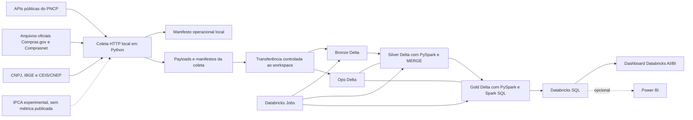
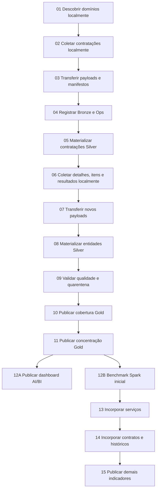

# RastroPublico — arquitetura e operação

## 1. Princípios

1. Coleta HTTP e processamento distribuído têm responsabilidades diferentes.
2. O landing preserva a evidência original; staging, Silver e Gold são reconstruíveis.
3. O grão e a chave são definidos antes do schema físico.
4. Toda escrita é idempotente e toda publicação é rastreável.
5. Reprocessamento parte da Bronze, sem nova chamada à fonte quando o payload já existe.
6. Qualidade e cobertura fazem parte do produto.
7. Otimização Spark depende de plano e métricas, não de preferência pessoal.
8. Notebooks são pontos de entrada; regras ficam em módulos Python testáveis.
9. Recursos nativos do Databricks e Delta têm prioridade sobre novas ferramentas.
10. Arquitetura futura não será construída antecipadamente.

## 2. Visão arquitetural



## 3. Ambientes

### 3.1 Principal

Databricks Free será o ambiente de execução e demonstração. A documentação oficial consultada em 17/07/2026 informa:

- apenas compute serverless, com tamanho e uso limitados;
- acesso de saída à internet restrito a domínios confiáveis;
- um SQL Warehouse limitado a `2X-Small`;
- no máximo cinco tarefas de Jobs concorrentes por conta;
- um workspace e um metastore;
- ausência de SLA e uso destinado a fins não comerciais.

Fonte: [limitações do Databricks Free](https://docs.databricks.com/aws/en/getting-started/free-edition-limitations).

Consequências:

- no máximo cinco tarefas concorrentes, preferencialmente menos;
- nenhuma coleta de fonte externa dependerá do egress serverless enquanto a restrição atual permanecer;
- ingestão no Databricks começa nos payloads e manifestos transferidos pela coleta local;
- nenhuma dependência de configuração de cluster customizada;
- evidência de performance limitada ao ambiente medido;
- Spark UI indisponível; planos e métricas serão inspecionados por Query Profile e `EXPLAIN`;
- APIs de cache/persistência de DataFrame e SQL indisponíveis no serverless; benchmarks não dependerão delas;
- ausência de alegações de produção ou SLA.

Fonte complementar: [limitações do compute serverless](https://docs.databricks.com/aws/en/compute/serverless/limitations).

### 3.2 Desenvolvimento local

O ambiente local suporta:

- módulos Python;
- testes unitários;
- testes PySpark com datasets pequenos;
- validação do coletor;
- coleta das APIs e arquivos oficiais, mantendo cada sistema e canal identificados;
- geração do payload e manifesto antes da transferência ao workspace.

Payloads, manifestos, staging e caches volumosos usam `D:\RastroPublico\data` no ambiente atual. O SSD `C:` mantém somente código, testes e documentação pequenos. O caminho de dados é externo ao repositório e deve ser recebido por parâmetro, nunca fixado nos módulos.

O local não substitui a evidência de execução Spark no Databricks.

## 4. Componentes

| Componente | Responsabilidade | Não faz |
| --- | --- | --- |
| Coletor HTTP/arquivo | Paginação ou download streaming, retry, payload/arquivo e manifesto | Transformações distribuídas |
| Transferência ao workspace | Enviar lotes íntegros e reconciliáveis da coleta local | Alterar ou interpretar payloads |
| Loader Bronze | Registrar payload e metadados em Delta | Deduplicar a entidade de negócio |
| Transformações Silver | Tipar, normalizar, deduplicar e aplicar `MERGE` | Definir conclusões analíticas |
| Transformações Gold | Calcular métricas com contrato e cobertura | Ocultar registros inválidos |
| Databricks Jobs | Parâmetros, dependências, retries e histórico | Orquestrar sistemas externos desnecessários |
| Databricks SQL e AI/BI | Consultas, validação e dashboard obrigatório da versão 1 | Ser fonte primária de transformação Python |
| Controle operacional `ops.*` | Runs, requisições, tentativas, watermarks, qualidade e versões | Armazenar entidades brutas de negócio |
| Quarentena | Preservar registro inválido e motivo | Corrigir silenciosamente a fonte |

## 5. Camadas de dados

### 5.1 Landing imutável e Bronze de ingestão

Características:

- arquivos originais append-only no landing;
- payload original preservado;
- uma observação por resposta/página para APIs ou por arquivo oficial para canais CSV;
- hash determinístico;
- metadados mínimos de origem e referência à execução;
- nenhuma normalização destrutiva.

A evidência durável é o arquivo original no Volume/HD, acompanhado de manifesto e SHA-256. A Bronze de ingestão registra observações sem reescrever o arquivo. O recorte anual usado pelas transformações é materializado em `workspace.staging.*` com `overwrite`: ele é um snapshot reconstruível, não a Bronze imutável. Falhas HTTP sem payload de fonte utilizável pertencem somente ao controle operacional.

| Tabela prevista | Grão | Conteúdo |
| --- | --- | --- |
| `bronze.contratacoes_raw` | Resposta/página coletada | Contratações por publicação ou atualização |
| `bronze.itens_raw` | Resposta de itens de uma contratação | Itens originais |
| `bronze.resultados_raw` | Resposta de resultados de um item | Fornecedores e valores homologados |
| `bronze.contratos_raw` | Resposta/página coletada | Contratos por publicação/atualização/detalhe |
| `bronze.historicos_raw` | Resposta de histórico | Eventos de contratação ou contrato |
| `bronze.dominios_raw` | Resposta de um domínio | Modalidades e códigos auxiliares |
| `bronze.arquivos_fonte` | Um arquivo oficial íntegro | Hash, tamanho, período, dataset, sistema e caminho imutável no Volume |
| `bronze.cnpj_raw` | Um arquivo/competência cadastral | CNPJ e QSA preservados conforme publicação oficial |
| `bronze.geografia_raw` | Uma versão de referência | Códigos e hierarquias territoriais do IBGE |
| `bronze.indices_precos_raw` | Uma observação experimental | IPCA coletado, sem uso em indicador publicado |
| `bronze.cadastros_correcionais_raw` | Uma ocorrência publicada | CEIS/CNEP com fonte e data de referência |

Metadados mínimos:

- `run_id`;
- `sistema_origem` e `canal_entrega`;
- `dataset_origem` e `endpoint`, quando aplicável;
- `url_origem` ou parâmetros normalizados;
- `coletado_em_utc`;
- `data_publicacao_arquivo`, quando fornecida;
- `data_inicio_consulta` e `data_fim_consulta`;
- `pagina`;
- `hash_payload`;
- `payload` ou `caminho_arquivo_imutavel`;
- `tamanho_bytes` e `schema_observado` para arquivos.

### 5.2 Controle operacional

| Tabela prevista | Grão | Conteúdo |
| --- | --- | --- |
| `ops.ingestion_runs` | Uma execução lógica | Parâmetros, início, fim, status e resumo |
| `ops.ingestion_requests` | Uma tentativa HTTP | Endpoint, página, tentativa, status HTTP, duração e erro sanitizado |
| `ops.ingestion_artifacts` | Um download ou transferência | URL, arquivo, bytes, hashes, duração, estado e destino |
| `ops.pipeline_state` | Um pipeline e recorte incremental | Watermark concluído e versão de estado |
| `ops.quality_results` | Uma regra por run e escopo | Severidade, contagens, cobertura e resultado |

`run_id` liga Bronze, Silver, Gold e `ops.*`. Metadados de proveniência permanecem junto ao payload; estado de execução e erro não são duplicados como se fossem dado bruto de negócio.

### 5.3 Silver

| Tabela prevista | Grão | Responsabilidade |
| --- | --- | --- |
| `silver.orgaos` | Um órgão canônico | Identificação institucional |
| `silver.unidades_compradoras` | Uma unidade de um órgão | Local e vínculo institucional |
| `silver.fornecedores` | Um fornecedor canônico | Identificação e pseudonimização quando necessária |
| `silver.contratacoes` | Uma contratação corrente | Estado analítico mais recente |
| `silver.itens_contratacao` | Um item de contratação | Quantidade, unidade, descrição e valores |
| `silver.resultados_itens` | Um resultado de um item | Fornecedor, classificação e homologação |
| `silver.contratos` | Um contrato/empenho corrente | Valor, vigência e vínculo com contratação |
| `silver.eventos_contratacao` | Um evento de contratação | Inclusão, retificação ou exclusão |
| `silver.eventos_contrato` | Um evento contratual | Termos, alterações e exclusões |
| `silver.categorias_tecnologia` | Uma regra/categoria versionada | Classificação do recorte tecnológico |
| `silver.unidades_normalizadas` | Um mapeamento de unidade | Comparabilidade de quantidade/preço |
| `silver.registros_quarentena` | Um registro rejeitado por regra | Evidência, motivo e origem |
| `silver.geografias` | Um código territorial versionado | Hierarquia oficial do IBGE |
| `silver.indices_precos` | Uma competência experimental | IPCA preparado, sem consumo pela Gold atual |
| `silver.contexto_correcional` | Fornecedor, cadastro e ocorrência | CEIS/CNEP datados e separados das métricas de contratação |

### 5.4 Gold

| Tabela prevista | Grão principal |
| --- | --- |
| `gold.qualidade_cobertura` | Período, entidade e recorte |
| `gold.concentracao_fornecedores` | Período, órgão, categoria e modalidade |
| `gold.recorrencia_orgao_fornecedor` | Órgão, fornecedor, categoria e período |
| `gold.presenca_fornecedor` | Fornecedor, categoria, geografia e período |
| `gold.variacao_precos` | Grupo comparável, geografia e período |
| `gold.linha_tempo_contratual` | Contrato e evento temporal |
| `gold.arestas_orgao_fornecedor` | Órgão, fornecedor, categoria e período; não constitui análise de grafos |

Schemas e colunas são previsões. O Bloco 0 confirmou campos e chaves candidatas, mas eles só se tornam contratos físicos no bloco da respectiva entidade, com fixtures reais e testes.

O Bloco 6A confirmou os dois primeiros contratos físicos. `gold.qualidade_cobertura` combina cobertura analítica por mês, modalidade e categoria com o resultado operacional mais recente de cada regra de `ops.quality_results`. `gold.concentracao_fornecedores` usa mês de publicação, órgão, categoria e modalidade; preserva grupos insuficientes com `status_publicacao = 'nao_publicavel'` em vez de ocultá-los. A Silver de contratações passou a preservar `publicado_em`, `modalidade_id` e `modalidade` como campos de negócio incluídos no hash canônico.

## 6. Estratégia incremental

### 6.1 Bootstrap

1. baixar os arquivos anuais oficiais necessários por período e registrar hash/data de publicação;
2. carregar entidades de forma independente, sem exigir fechamento referencial dentro do mesmo arquivo;
3. usar a API PNCP para reconciliação e lacunas quando disponível;
4. selecionar candidatos de tecnologia;
5. buscar localmente detalhes, itens, resultados e históricos;
6. fechar payloads e manifestos do lote;
7. transferir e reconciliar o lote no workspace;
8. registrar respostas na Bronze e tentativas/estado em `ops.*`;
9. materializar Silver por `MERGE`;
10. publicar Gold apenas após qualidade.

### 6.2 Carga incremental e reconstrução atual

1. ler último watermark concluído e o último hash por dataset;
2. baixar arquivos diários somente quando publicação ou conteúdo mudar;
3. consultar endpoints de atualização do PNCP quando disponíveis;
4. transferir e reconciliar os novos payloads e manifestos;
5. registrar novas observações na Bronze e o estado da coleta em `ops.*`;
6. identificar chaves afetadas nas entidades que usam `MERGE`;
7. atualizar essas entidades e reconstruir integralmente o núcleo Silver atual;
8. reconstruir as Gold da janela;
9. executar validações;
10. avançar watermark somente após sucesso integral da coleta, transferência e materialização.

A sobreposição inicial é de três dias. A coleta, os artefatos e `silver.contratacoes` possuem comportamento incremental; o núcleo Silver e as Gold são reconstruções integrais idempotentes da janela. O projeto não chama esse trecho de incremental por chaves. Uma futura troca para `MERGE` exige medição, equivalência lógica e necessidade operacional.

### 6.3 Parâmetros mínimos

- `data_inicio`;
- `data_fim`;
- `modalidades` ou `todas_ativas`;
- `modo`: `bootstrap`, `incremental` ou `reprocessamento`;
- `run_id`;
- `origem_coleta`: `local` no ambiente atual;
- `sistema_origem`, `canal_entrega` e `dataset_origem`;
- identificador e hash do lote de transferência;
- chave ou partição opcional para reprocessamento.

## 7. Deduplicação e correções

### 7.1 Repetição técnica

Uma resposta idêntica é detectada pelo hash do payload, mas continua auditável na Bronze. Ela não gera nova versão lógica na Silver.

`hash_payload` identifica a resposta HTTP bruta. Antes da deduplicação por entidade, a transformação calcula `hash_conteudo_entidade` sobre campos canônicos, excluindo metadados técnicos. A decisão do `MERGE` usa o hash da entidade, nunca o hash da página inteira.

#### Contrato implementado de hash canônico

A função compartilhada recebe uma lista ordenada e explícita de campos de negócio,
inclui `versao_canonicalizacao` dentro do `struct`, serializa por `to_json` com
`ignoreNullFields=false` e calcula SHA-256. Metadados técnicos não entram na
lista. A escala decimal e o tipo temporal são definidos antes do hash pelo schema
da entidade. A versão fica armazenada junto ao registro.

O código não promete normalização Unicode NFC, ordenação genérica de arrays ou
distinção entre campo ausente e `NULL` depois da projeção Spark. Entidades que
precisarem dessas garantias deverão implementá-las e elevar a versão do contrato
antes de comparar hashes novos e antigos.

### 7.2 Versão corrente

Ordem inicial de seleção:

1. chave natural validada;
2. `dataAtualizacao` da fonte;
3. data do evento de histórico, quando a entidade possuir semântica temporal compatível;
4. política específica e documentada por entidade quando a fonte não fornecer versão confiável.

O instante de coleta ordena observações técnicas, mas não prova que o estado da fonte é mais novo. O hash detecta igualdade ou conflito, mas também não define precedência. Empates e versões sem ordenação confiável vão para alerta ou quarentena; não são resolvidos por ordem aleatória de partição.

### 7.3 Delta `MERGE`

O `MERGE` deve:

- inserir chave inexistente;
- atualizar somente quando a versão da fonte for comprovadamente mais recente;
- ignorar versão igual com `hash_conteudo_entidade` igual;
- enviar versão igual com `hash_conteudo_entidade` diferente para conflito, sem sobrescrever o estado corrente;
- ignorar versão mais antiga para fins de estado corrente, preservando a observação na Bronze;
- aplicar política explícita por entidade quando não houver versão confiável;
- preservar campos técnicos da origem e da atualização;
- registrar contagens de inseridos, atualizados e inalterados.

Antes do `MERGE`, a fonte deve ser reduzida deterministicamente a no máximo uma linha candidata por chave de destino. Múltiplas linhas de origem tentando atualizar a mesma linha tornam a operação ambígua.

### 7.4 Cancelamentos e exclusões

Registros cancelados ou excluídos não são apagados fisicamente da Bronze. A Silver mantém estado corrente e campos de situação. Gold aplica filtros explícitos por indicador.

### 7.5 Histórico Delta

`DESCRIBE HISTORY` e time travel serão usados como evidência operacional de escritas e validações antes/depois. A Bronze continua sendo o histórico durável da fonte; a recuperação não dependerá apenas da retenção de versões Delta. Política de `VACUUM` e retenção só será definida após validar limites do ambiente e necessidade de reprocessamento.

## 8. Reprocessamento

Modos suportados:

- uma página ou resposta Bronze;
- uma janela de datas e modalidades;
- uma contratação ou contrato;
- uma tabela Silver completa;
- um período ou recorte Gold;
- reconstrução total a partir da Bronze.

Regras:

- reprocessamento usa os mesmos módulos e validações da execução normal;
- nenhuma escrita cria duplicata lógica;
- watermark não é alterado por padrão;
- parâmetros, tabela de origem e versão Delta são registrados;
- falha mantém a versão Gold anterior disponível.

## 9. Jobs e dependências



O desenho lógico pode ser agrupado em menos tarefas físicas para respeitar o limite de concorrência do Databricks Free. Não haverá uma tarefa separada apenas para corresponder a cada caixa do diagrama.

Retries serão aplicados pelo coletor local às falhas transitórias da fonte e pelo Databricks às falhas de transferência/processamento. Erros determinísticos de contrato ou qualidade não serão repetidos automaticamente.

## 10. Qualidade e quarentena

### 10.1 Classes de resultado

| Classe | Efeito |
| --- | --- |
| Bloqueante | Job falha e não publica a saída |
| Quarentena | Registro é preservado fora da Silver válida |
| Descarte controlado | Registro sem utilidade analítica é contado e justificado |
| Alerta de cobertura | Job conclui, mas a limitação acompanha a saída |

### 10.2 Regras iniciais

- identificador de controle obrigatório quando previsto;
- chave única após deduplicação;
- CNPJ estruturalmente válido quando o tipo de pessoa exigir CNPJ;
- valores monetários não negativos, salvo semântica documentada de supressão;
- quantidade maior que zero para cálculo unitário;
- datas de início e fim coerentes;
- item vinculado a contratação;
- contrato vinculado a órgão e, quando informado, à contratação;
- resultado vinculado a item;
- fornecedor identificável para métricas de concentração;
- unidade normalizada para comparação de preço;
- versão corrente selecionada deterministicamente;
- cancelamento e orçamento sigiloso tratados como estados, não como zero comum.

### 10.3 Reconciliação

Para cada transformação:

`entrada = válidos + quarentena + descartes controlados`

Também serão reconciliados:

- páginas esperadas versus coletadas;
- chaves Bronze versus chaves Silver;
- valores e contagens em amostras;
- registros afetados pelo `MERGE`;
- períodos Gold recalculados.

## 11. Observabilidade

Cada run registra:

- `run_id`, job, tarefa e tentativa;
- parâmetros e ambiente;
- início, fim, duração e status;
- endpoints, páginas e status HTTP;
- registros lidos, escritos, inseridos, atualizados e inalterados;
- válidos, quarentena e descartes;
- watermark anterior e novo;
- versões Delta de entrada e saída;
- número de arquivos e partições relevantes;
- métricas de cobertura;
- erro resumido sem payload sensível.

Para jobs Spark, o benchmark registra:

- plano inicial obtido por `SQL EXPLAIN`, que não executa a consulta;
- plano físico efetivamente executado, observado no Query Profile ou em evidência equivalente disponível;
- estratégia solicitada por hint;
- estratégia efetivamente escolhida;
- indicação de hint aceito, ignorado ou superado por decisão adaptativa;
- shuffle, spill quando disponível, duração e estatísticas de runtime.

O experimento compara a estratégia natural com estratégias candidatas por hints suportados; não presume que a estratégia solicitada será a executada. Spark UI não está disponível no serverless. Se a interface gratuita não expuser alguma métrica, a ausência será documentada.

## 12. Testes

### 12.1 Unitários

- chaves canônicas;
- CNPJ e pseudonimização;
- normalização de unidade;
- classificação tecnológica;
- seleção da versão corrente;
- fórmulas de indicadores.

### 12.2 Transformações PySpark

- duplicatas e versões fora de ordem;
- nulos e tipos inválidos;
- `MERGE` repetido;
- joins com dimensões ausentes;
- cancelamentos;
- quarentena e reconciliação.

### 12.3 Contrato da fonte

- presença de campos essenciais;
- paginação;
- resposta vazia;
- alteração compatível e incompatível de schema.

Chamadas reais ao PNCP não serão obrigatórias na CI.

### 12.4 Integração

- fixture Bronze até Silver;
- Silver até Gold;
- repetição da mesma janela;
- correção posterior;
- reprocessamento e reconstrução.

## 13. Segurança e privacidade

- credenciais e tokens não são versionados;
- URLs e logs não incluem segredos;
- dados brutos não são enviados ao GitHub;
- fixtures públicas são mínimas e anonimizadas quando necessário;
- CPF não aparece em Gold, Databricks SQL ou Power BI;
- fornecedor pessoa física recebe chave pseudonimizada estável para análise;
- dados públicos continuam sujeitos a uso responsável e minimização.

## 14. Estrutura executada do repositório

A versão 1 usa a seguinte estrutura mínima:

```text
docs/
src/rastro_publico/
  coleta/
  transformacoes/
notebooks/
tests/
pyproject.toml
uv.lock
```

Não foram criados pacotes vazios, frontend, API, Airflow, dbt ou infraestrutura
como código sem necessidade demonstrada. A configuração operacional dos jobs
permanece no Databricks e seus parâmetros executados estão registrados no
runbook e nos relatórios.

## 15. Situação operacional final

- dados locais volumosos: `D:\RastroPublico`, fora do Git;
- landing: Volume gerenciado `workspace.rastro_publico_dev.landing`;
- execução anual: job `399795155769573`, seis tarefas encadeadas, retry e
  concorrência máxima igual a um;
- benchmark: job `79177278313280`;
- consumo: SQL Warehouse `c8b5924d51fcc1e2` e dashboard
  `01f182507d3519de8cd5931bef2d613f`;
- runtime observado: Python 3.10.12 e Spark 4.1.0 serverless; testes locais em
  Python 3.12 e PySpark 4.2.0, usando somente APIs compatíveis;
- organização física mantida sem particionamento ou clustering após benchmark:
  39 arquivos nas duas fatos principais, zero spill e nenhum ganho comprovado
  para compactação ou hints fixos.

O diagrama, a cadeia de dependências e o procedimento de recuperação executados
estão consolidados em `20-arquitetura-final.md` e `21-runbook-operacional.md`.
