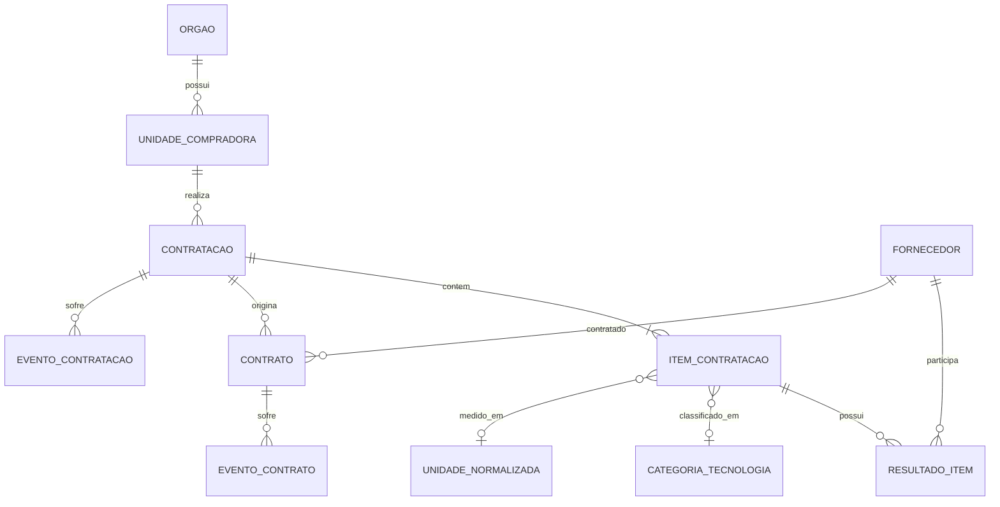

# RastroPublico — modelo conceitual e métricas

## 1. Regras de modelagem

- o grão é declarado antes da lista de campos;
- identificadores oficiais têm prioridade sobre chaves geradas;
- chaves candidatas permanecem provisórias até teste de unicidade;
- material e serviço não compartilham automaticamente o mesmo grupo comparável;
- estado corrente e histórico são modelos distintos;
- métricas de resultado homologado e de contrato não são misturadas;
- todo indicador publica cobertura e limitações.

## 2. Modelo conceitual

A relação entre contratação e contrato pode estar ausente ou ser indireta. Ela só será obrigatória quando a fonte fornecer o identificador correspondente.

## 3. Entidades, grãos e chaves

| Entidade | Grão | Chave candidata | Observação |
| --- | --- | --- | --- |
| Órgão | Um órgão/entidade | CNPJ do órgão | Validar órgãos sem CNPJ esperado |
| Unidade compradora | Uma unidade dentro do órgão | CNPJ do órgão + código da unidade | Código pode não ser global |
| Contratação | Uma contratação PNCP | número de controle PNCP | Fallback: CNPJ + ano + sequencial |
| Item | Um item de contratação | contratação + `numeroItem` | Número documentado como único na contratação |
| Resultado | Um resultado de item | item + `sequencialResultado` | Pode haver cancelamento e mais de um resultado |
| Fornecedor | Uma identidade fornecedora | tipo de pessoa + país + identificador | CPF deve ser pseudonimizado no consumo |
| Contrato | Um contrato/empenho PNCP | número de controle PNCP | Diferenciar contrato e empenho quando disponível |
| Evento de contratação | Uma operação registrada | contratação + instante + categoria + recurso | Desempate ainda depende da amostra |
| Evento de contrato | Uma operação registrada | contrato + instante + categoria + recurso | Pode representar termo, documento ou contrato |
| Categoria de tecnologia | Uma regra versionada | versão + código da categoria | Classificação deve ser reproduzível |
| Unidade normalizada | Um mapeamento de unidade | unidade original + versão da regra | Não converter unidade sem fator confiável |

## 4. Atributos conceituais mínimos

### 4.1 Contratação

- identificador PNCP;
- órgão e unidade;
- modalidade;
- processo e objeto;
- datas de publicação, inclusão e atualização;
- situação;
- valor global estimado, quando semanticamente aplicável;
- origem, versão e `run_id`.

### 4.2 Item

- contratação e número do item;
- material ou serviço;
- descrição e informação complementar;
- quantidade e unidade;
- valor unitário estimado e valor total;
- orçamento sigiloso;
- situação e existência de resultado;
- catálogo, NCM/NBS e categoria quando disponíveis;
- datas de inclusão e atualização.

### 4.3 Resultado

- item e sequencial do resultado;
- fornecedor e tipo de pessoa;
- ordem/classificação quando disponível;
- quantidade homologada;
- valor unitário e valor total homologado;
- situação e data de cancelamento;
- datas de inclusão e atualização.

### 4.4 Contrato

- identificador do contrato;
- vínculo com contratação;
- órgão, unidade e fornecedor;
- tipo de contrato/empenho;
- objeto;
- valor inicial/global;
- datas de assinatura, início e fim de vigência;
- situação;
- datas de inclusão e atualização.

### 4.5 Evento contratual

- contrato;
- instante do evento;
- tipo da operação: inclusão, retificação ou exclusão;
- categoria do recurso;
- termo/documento relacionado;
- justificativa;
- alterações de valor ou vigência quando disponíveis.

## 5. Identidade do fornecedor

Regra inicial:

1. preservar tipo de pessoa, país e identificador original na camada controlada;
2. normalizar caracteres e formato sem alterar o valor semântico;
3. validar CNPJ apenas quando o fornecedor for pessoa jurídica brasileira;
4. gerar chave canônica determinística;
5. substituir CPF por hash com segredo fora do repositório nas camadas de consumo;
6. não unir fornecedores apenas por razão social semelhante.

Nome normalizado serve para busca e análise de qualidade, não como chave de união automática.

## 6. Classificação tecnológica

### 6.1 Taxonomia inicial

| Tipo | Categorias iniciais |
| --- | --- |
| Equipamento | computador/notebook, monitor, impressora/scanner, servidor, rede |
| Serviço | suporte, licenciamento, desenvolvimento/manutenção de software, outsourcing, infraestrutura, cloud |

### 6.2 Resultado da classificação

Cada item recebe:

- `categoria_tecnologia`;
- `subcategoria_tecnologia`, quando possível;
- `metodo_classificacao`;
- `regra_classificacao` e versão;
- `confianca_classificacao`: `estruturada`, `lexical` ou `incerta`;
- evidência utilizada;
- indicador de revisão necessária.

Não haverá modelo de machine learning na versão 1. Regras estruturadas e vocabulário versionado são suficientes até que uma avaliação demonstre o contrário.

### 6.3 Ordem de calibração

1. equipamentos com maior disponibilidade de quantidade, unidade e códigos estruturados;
2. serviços para concentração, recorrência, presença e relações contratuais;
3. comparação de preço de serviços somente em grupos cuja unidade, escopo e condições sejam demonstravelmente equivalentes.

Essa ordem reduz risco sem retirar serviços do escopo final.

## 7. Comparabilidade de preço

Um item só entra em análise de preço quando houver:

- categoria tecnológica compatível;
- separação entre material e serviço;
- quantidade positiva;
- unidade conhecida e normalizada;
- preço unitário disponível ou calculável;
- situação válida para a métrica;
- ausência de orçamento sigiloso interpretado como zero;
- descrição sem indicação conhecida de lote composto incompatível.

### 7.1 Chave inicial do grupo comparável

Prioridade:

1. código de catálogo validado + unidade normalizada;
2. NCM/NBS + categoria + unidade normalizada;
3. categoria e subcategoria + atributos estruturados + unidade;
4. grupo lexical somente quando validado por amostra.

Serviços de desenvolvimento, outsourcing, infraestrutura e cloud não serão comparados apenas por “unidade”. Escopo, nível de serviço, senioridade, consumo e vigência podem tornar preços incomparáveis. Esses serviços podem participar de concentração e recorrência mesmo quando forem excluídos da comparação de preço.

## 8. Contratos de indicadores

### 8.1 Cobertura e qualidade

- **Pergunta:** quanto do recorte possui informação suficiente para cada análise?
- **Grão:** período, entidade, modalidade e categoria.
- **Campos:** contagens totais, válidas, em quarentena e preenchimento por campo.
- **Métricas:** cobertura de fornecedor, identificador, unidade, quantidade, preço, categoria, vínculo contratual e comparabilidade.
- **Interpretação permitida:** qualidade e disponibilidade observadas no PNCP para o recorte.
- **Evitar:** concluir qualidade do processo administrativo apenas pela completude do portal.

### 8.2 Concentração de fornecedores — primeiro indicador de negócio

- **Pergunta:** como o valor se distribui entre fornecedores no recorte?
- **Grão:** período, órgão, categoria tecnológica e modalidade.
- **Base principal:** valor homologado dos resultados válidos.
- **Base separada:** valor contratual, quando analisado em tabela própria.
- **Métricas:** fornecedores distintos, participação Top 1, participação Top 3 e HHI.
- **Cobertura:** percentual de registros e valor com fornecedor, categoria e valor válidos.
- **Interpretação permitida:** grau de concentração observado naquele grão e período.
- **Evitar:** afirmar favorecimento, ausência de competição ou irregularidade.

Fórmulas:

- `participacao_fornecedor = valor_fornecedor / valor_total_grupo`;
- `top_1 = maior(participacao_fornecedor)`;
- `top_3 = soma(das tres maiores participacoes)`;
- `hhi = soma(participacao_fornecedor²)`.

O HHI será publicado na escala `0–1`, acompanhado do número de fornecedores e cobertura. Nenhum limiar jurídico ou concorrencial será assumido sem contexto aplicável.

### 8.3 Recorrência órgão–fornecedor

- **Pergunta:** com que frequência a mesma relação aparece?
- **Grão:** órgão, fornecedor, categoria e período.
- **Campos:** contratações, resultados, contratos e datas.
- **Métricas:** contratações distintas, contratos distintos, períodos ativos e intervalo entre ocorrências.
- **Limitação:** repetição pode decorrer de especialização, continuidade ou estrutura do mercado.
- **Interpretação permitida:** recorrência observada.
- **Evitar:** tratar recorrência como dependência indevida.

### 8.4 Presença pública do fornecedor

- **Pergunta:** quão distribuída é a atuação do fornecedor?
- **Grão:** fornecedor, categoria e período.
- **Métricas:** órgãos, unidades, UFs, municípios, modalidades e valor total distintos.
- **Limitação:** ausência no PNCP não comprova ausência em toda contratação pública.
- **Interpretação permitida:** presença dentro da cobertura coletada.

### 8.5 Variação de preços

- **Pergunta:** como o preço unitário se distribui em um grupo comparável?
- **Grão:** grupo comparável, período e geografia opcional.
- **Métricas:** quantidade de observações, mediana, percentis, mínimo, máximo e distância relativa da mediana.
- **Cobertura:** percentual de itens classificados como comparáveis.
- **Limitação:** frete, garantia, configuração, prazo, lote e condições contratuais podem explicar diferenças.
- **Interpretação permitida:** variação e observações distantes do grupo.
- **Evitar:** afirmar sobrepreço ou superfaturamento.

### 8.6 Evolução contratual

- **Pergunta:** como valor e vigência evoluem após a contratação?
- **Grão:** contrato e evento em ordem temporal.
- **Métricas:** número de alterações, variação acumulada de valor, extensão de vigência e mudança de fornecedor quando disponível.
- **Limitação:** histórico pode registrar operação sem fornecer todos os valores anteriores e posteriores.
- **Interpretação permitida:** sequência de eventos publicada.
- **Evitar:** assumir que toda alteração é aditivo financeiro ou que ausência de evento significa ausência de alteração.

### 8.7 Rede órgão–fornecedor

- **Pergunta:** quais relações conectam órgãos e fornecedores?
- **Grão:** aresta órgão–fornecedor, categoria e período.
- **Métricas:** valor, contratações, contratos, recorrência e modalidades.
- **Limitação:** é uma representação agregada; não comprova relação societária ou pessoal.
- **Interpretação permitida:** intensidade e distribuição das relações de compra.

## 9. Ordem de publicação Gold

1. `gold.qualidade_cobertura`;
2. `gold.concentracao_fornecedores`;
3. `gold.recorrencia_orgao_fornecedor`;
4. `gold.presenca_fornecedor`;
5. `gold.variacao_precos`;
6. `gold.linha_tempo_contratual`;
7. `gold.rede_orgao_fornecedor`.

Cada indicador deve ser efetivamente avaliado e terminar como `publicado` ou `não publicável`. O segundo estado exige regra, medição de cobertura, avaliação de comparabilidade/semântica e justificativa reproduzível. Se os dados necessários nem puderem ser obtidos ou processados, a capacidade fica `bloqueada` e impede concluir a versão 1.

## 10. Validações analíticas

- `0 <= top_1 <= top_3 <= 1`;
- `0 <= hhi <= 1`;
- participação dos fornecedores soma aproximadamente 1 dentro da tolerância decimal;
- número de fornecedores distintos é compatível com o HHI;
- mediana e percentis mantêm ordem monotônica;
- preço unitário reproduz quantidade e total dentro da tolerância definida;
- eventos estão ordenados e ligados ao contrato correto;
- contagens Gold reconciliam com a população Silver elegível;
- amostras são conferidas no portal oficial.

## 11. Decisões ainda abertas

- campos definitivos de cada entidade;
- identificador canônico quando o número de controle estiver ausente;
- tratamento de fornecedor estrangeiro;
- segredo e estratégia operacional de pseudonimização;
- vocabulário e códigos exatos da taxonomia tecnológica;
- tolerância decimal para reconciliação;
- regra de unidade equivalente;
- população elegível de cada situação de item/resultado/contrato;
- cobertura mínima para publicar cada indicador;
- granularidade temporal padrão;
- capacidade real de medir variação de valor por evento contratual.

Essas decisões dependem do perfil dos dados e devem ser fechadas antes da tabela correspondente, não antes do spike.
