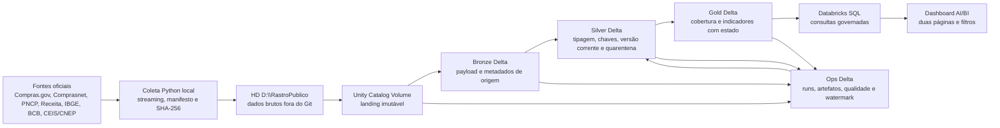
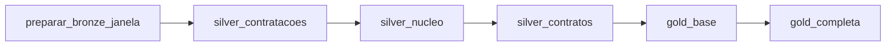

# RastroPublico — arquitetura executada da versão 1

## 1. Escopo desta arquitetura

Este documento descreve o que foi efetivamente executado até 18 de julho de
2026. Ele não amplia a cobertura observada: a janela de 12 meses é integral para
o canal oficial anual Compras.gov/Comprasnet aprovado, mas não representa todas
as 19 modalidades do universo PNCP.

## 2. Fluxo de dados

A paginação e os downloads HTTP usam Python comum. Spark entra quando os
arquivos já estão reunidos: leitura distribuída, tipagem, deduplicação, joins,
janelas, agregações, Delta e benchmark. Essa fronteira evita usar Spark como
cliente HTTP e mantém seu uso tecnicamente justificável.

## 3. Fronteiras e responsabilidades

| Componente | Responsabilidade executada |
| --- | --- |
| `src/rastro_publico/coleta` | download, polling, manifestos, fragmentação lógica, recortes contextuais e vínculos PNCP |
| `notebooks/02*` e `10*` | carga Bronze e preparação da janela anual |
| `notebooks/03*`, `04*` e `07*` | transformação Silver, quarentena, qualidade e estado operacional |
| `notebooks/05*` e `09*` | publicação Gold e enriquecimentos contextuais |
| `notebooks/06*` | benchmark Spark reproduzível |
| Unity Catalog | catálogos `workspace.bronze`, `workspace.silver`, `workspace.gold` e `workspace.ops` |
| Databricks Jobs | parâmetros, dependências, retry, histórico e reexecução |
| Databricks SQL/AI/BI | consumo sem recalcular regras analíticas |

## 4. Job definitivo da janela móvel

O job `399795155769573` executa uma cadeia única, com no máximo um run
concorrente e um retry por tarefa:

A janela materializada é `2025-07-18` a `2026-07-17`, encerrada em D-1. O run
definitivo `907362552312516` terminou em `SUCCESS`.

## 5. Estado materializado

| Camada | Principais tabelas | Linhas observadas |
| --- | --- | ---: |
| Bronze | contratações | 318.911 |
| Bronze | itens | 4.242.964 |
| Bronze | resultados | 1.931.154 |
| Bronze | contratos | 53.544 |
| Bronze | itens de contrato | 129.896 |
| Bronze | históricos contratuais | 60.988 |
| Silver | contratações correntes | 317.043 |
| Silver | itens de contratação | 2.631.909 |
| Silver | resultados de itens | 1.839.054 |
| Silver | fornecedores | 106.494 |
| Silver | órgãos / unidades | 3.526 / 7.039 |
| Silver | contratos / itens / eventos | 52.767 / 127.813 / 60.324 |

A diferença entre Bronze e Silver é explicada por versão corrente,
duplicidades, conflitos e quarentena; não é descarte silencioso.

## 6. Incrementalidade e recuperação

- Bronze e arquivos no Volume são a fonte imutável de recuperação.
- `ops.pipeline_state` só avança após materialização e regras bloqueantes.
- reprocessamento recebe `run_id`, datas e modo explícitos;
- sobreposição de três dias protege contra correções tardias no fluxo incremental;
- chaves determinísticas e `hash_conteudo_entidade` distinguem repetição técnica
  de mudança lógica;
- a origem do `MERGE` é reduzida a uma linha por chave antes da escrita;
- falha não avança watermark; a tarefa reparada pode ser reexecutada sem refazer
  tarefas verdes.

## 7. Consumo e linguagem responsável

O dashboard publicado é a interface da versão 1. Ele contém as páginas
`Visão geral` e `Análises e contexto`, filtros e tabelas alimentadas pelas Gold.
Não existe frontend próprio nem regra analítica duplicada na visualização.

Indicadores são descritivos. Recorrência, concentração, variação de preço e
presença em CEIS/CNEP são sinais para investigação e qualidade da informação;
não classificam fraude ou irregularidade.

## 8. Decisões finais de performance

No benchmark final, AQE escolheu broadcast para dimensões e shuffled hash para o
join volumoso. A estratégia natural teve mediana de 3.191 ms, broadcast explícito
3.234 ms e sort-merge explícito 6.947 ms, com checksum idêntico. Não foram
aplicados hint fixo, salting, reparticionamento ou compactação porque nenhuma
mudança apresentou ganho material no mesmo ambiente.

## 9. Limitações arquiteturais

- compute serverless não resolve `pncp.gov.br`; a coleta permanece local e o
  processamento no Databricks;
- o canal anual aprovado expôs 5 códigos de modalidade e 11 rótulos, abaixo das
  19 modalidades ativas do PNCP;
- o vínculo contratação–contrato é parcial (`C3`), portanto análises contratuais
  não inferem relações ausentes;
- grupos de preço foram medidos, mas permanecem `não publicável` por
  comparabilidade insuficiente;
- os caminhos do workspace contêm o usuário da conta atual e devem ser adaptados
  ao reproduzir em outro workspace.
